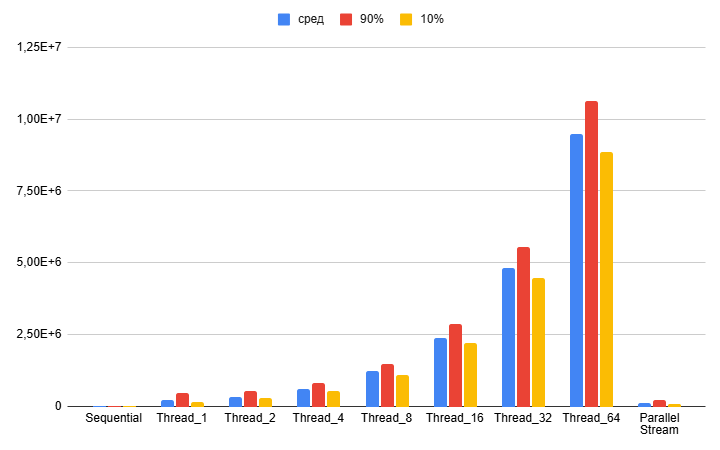
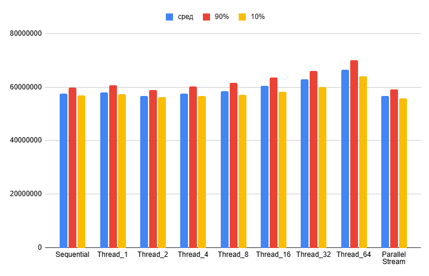
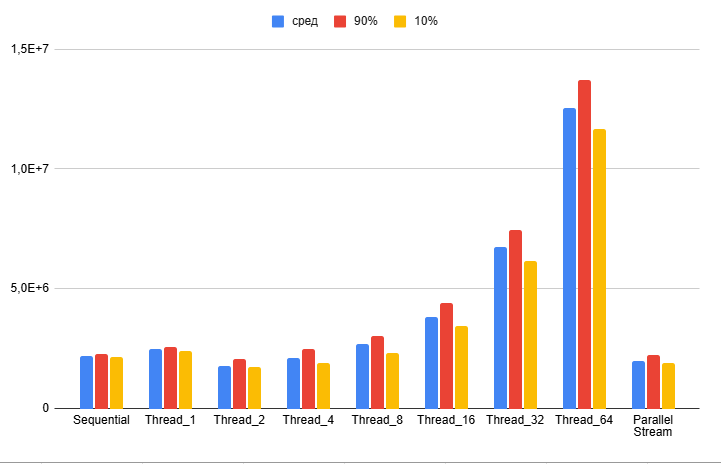
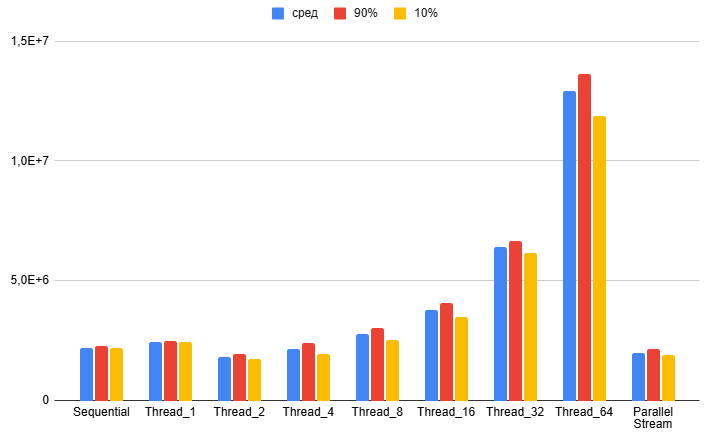

## Поиск составного чиста в массиве простых чисел

В данной задаче реализованы 3 алгоритма поиска.

(а) sequential - поиск составногочисла в последовательной программе  
(б) thread - 1.2.4.8.16.32.64 потоков созданных с помощью java.lang.Thread   
(в) stream - использование ParallelStream

### Исследование скорости поиска
Проведено исследование скорости работы этих алгоритмов. 
Для этого были сгенерированы 4 набора чисел:

short-small - массив длины 500 состоящий из чисел в диапазоне от 0 до 5000  
short-large - массив длины 500 состоящий из чисел 2 147 483 647  
long-small - массив длины 200 000 состоящий из чисел в диапазоне от 0 до 5000  
long-large - массив длины 200 000 состоящий из чисел размера около 2 147 483 647  

Результаты исследвания скорости работы алгоритмов предсталены на 
следующих рисунках.

На данных диаграммах представлены скорости работы алгоритмов на 4 массивах 
данных. Представлены среднее значение и 80% доверительный интервал (диапазон в который 
попадает 80% всех испытаний). Было проведено 500 замеров времени (испытаний). 
(1) short-small, (2) short-large, (3) long-small, (4) long-large  

### Дополнительные материалы
https://docs.google.com/spreadsheets/d/1HSffXEwEAg0_s_eztPOP3RRAis8MkwpMGHL04j8O9do/edit?gid=1526452564#gid=1526452564
