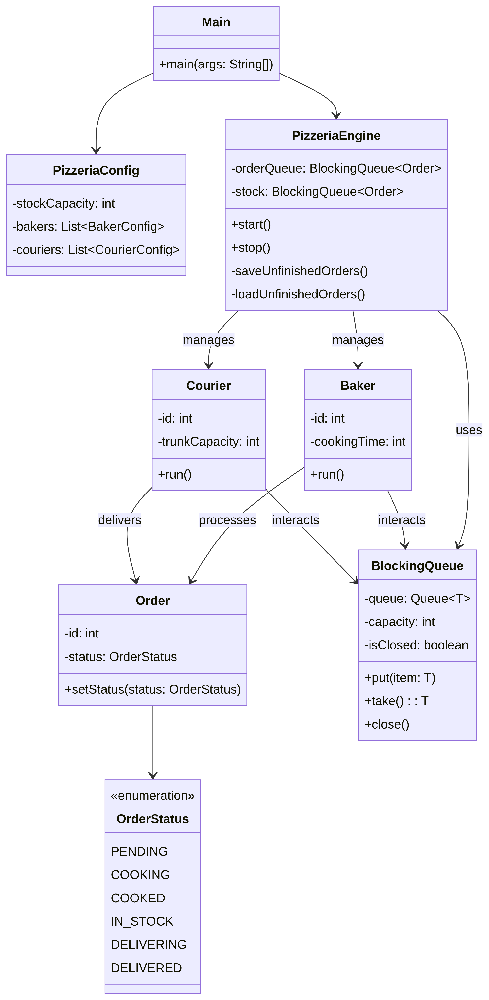

## Пиццерия

Пиццерия обрабатывает заказы на приготовление пиццы. Каждый заказ поступает из
потока ввода и обрабатывается пекарем. Есть набор пекарей, каждый из которых может
приготовить заказ. Далее один из курьеров забирает заказ со склада и доставляет его
зачазчику. 

Структура классов представлена на следующейц диаграмме.

**Диаграмма 1.** В классе Main на базе PizzeriaConfig создается PizzeriaEngine. PizzeriaEngine
содержит очередь заказов (orderQueue) и склад (stock). Склад имеет ограниченную вместимость. Так же 
PizzeriaEngine содержит набор пекарей (bakers) и доставщиков (couriers), каждый из которых запускается в
отдельном потоке (workerThreads). Во течении изготовления заказа вся информация логируется в консоль.
